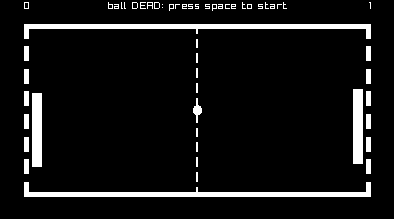

# A classic pong (and breakout) game



## About

I made this foremost to become familiar with raylib
and have an excuse in doing low level network programming.
Pong should have a simple online 2-player mode, which is still work in progress.

The breakout game is still (very) work in progress.

## build

A simple cmake build system.
Only tested on (arch) linux sofar, should work on any system with cmake and raylib support though.

Example:
```
mkdir build
cd build
cmake ..
make pong
./pong
```